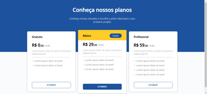
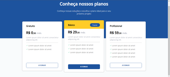
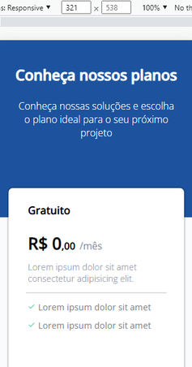
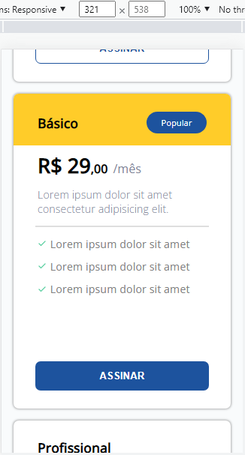

<h1 align='center'>Princing Table 💲</h1>

  <a href="#-sobre">Sobre</a>&nbsp;&nbsp;&nbsp;|&nbsp;&nbsp;&nbsp;
  <a href="#-prints">Prints</a>&nbsp;&nbsp;&nbsp;|&nbsp;&nbsp;&nbsp;
  <a href="#-tecnologias">Tecnologias</a>&nbsp;&nbsp;&nbsp;|&nbsp;&nbsp;&nbsp;
  <a href="#-licença">Licença</a>&nbsp;&nbsp;&nbsp;|&nbsp;&nbsp;&nbsp;

🚀 Projeto concluído ✅

## 💻 Sobre

Este projeto é uma página com uma tabela de preços de serviços fictícios. O projeto é mais um dos desafios do Curso Discover da Rocketseat. [Link para página do desafio](https://efficient-sloth-d85.notion.site/Desafio-Pricing-Table-e0b6f59253e54d229fdde09228226b32). O intuito do projeto é colocar em prática conhecimentos aprendidos durante o curso. 

## 📷 Prints

 

   

## 🛠 Tecnologias

- Linguagens: 
    - [HTML](https://developer.mozilla.org/pt-BR/docs/Web/HTML) 
    - [CSS](https://developer.mozilla.org/pt-BR/docs/Web/CSS)
- Ferramentas / Recursos: 
    - Editor: [Visual Studio Code](https://code.visualstudio.com/)
    - Fontes: [Open Sans](https://fonts.google.com/specimen/Open+Sans?query=Open+S)

## 📝 Licença 

O projeto está sob a [Licensa MIT](./LICENSE) 

Qualquer pessoa pode usar, clonar e contribuir com este projeto 👍😁 

